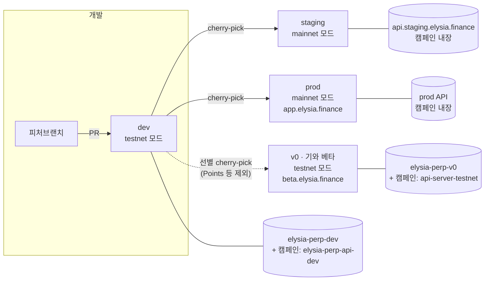

# 환경/브랜치 매트릭스

> 브랜치·백엔드·설정이 어떻게 나뉘어 있는지의 단일 참조 문서. (2026-08-14)



## 빠른 답 3가지

- **어디서 작업하나?** → 항상 `origin/dev` 기준 피처브랜치 → PR. 배포
  브랜치(v0/staging/prod)에 직접 커밋 금지 (명시적 "그 브랜치만" 지시 예외).
- **전파는 어떻게?** → dev 머지 후 요청 시 cherry-pick + `tsc` 검증.
  미반영분 확인은 ↓ (해시가 갈라져 있어 패치 동등성으로 비교):
  ```bash
  git log --oneline --no-merges --cherry-pick --right-only \
    origin/staging...origin/dev --reverse
  ```
- **v0는 왜 다르나?** → 기와 해커톤 빌드. USDC 우선·기본 마켓
  BTC-PERP-USDC·Points 미포함 등이 **브랜치 커밋**으로 박혀 있어 전파 시
  선별 필요. (상세: 아래 "v0 전용 차이")

## 환경 매트릭스

|                 | **dev**             | **v0**                  | **staging**                | **prod**           |
| --------------- | ------------------- | ----------------------- | -------------------------- | ------------------ |
| 역할            | 통합 개발           | 기와 테스트넷 베타      | 메인넷 리허설              | 실서비스           |
| 프론트 도메인   | (Vercel dev 배포)   | beta.elysia.finance     | (Vercel staging 배포)      | app.elysia.finance |
| Vercel 프로젝트 | elysia-perp-ui      | **elysia-giwa-perp-ui** | elysia-perp-ui             | elysia-perp-ui     |
| 메인 API        | elysia-perp-dev     | elysia-perp-v0          | api.staging.elysia.finance | (prod API)         |
| 캠페인 API      | elysia-perp-api-dev | api-server-testnet      | 메인 API 내장              | 메인 API 내장      |
| 네트워크 모드   | testnet             | testnet (Giwa 중심)     | mainnet                    | mainnet            |
| Points 페이지   | ✅                  | ❌ 의도적 미포함        | ✅                         | ✅                 |
| GA / 인덱싱     | ❌                  | ❌                      | ❌                         | ✅                 |

**네트워크 모드**: `NEXT_PUBLIC_NETWORK=mainnet`이면 `@network-config`
alias가 `network-config.mainnet.ts`를 가리킴 (빌드 타임 분기). **메인넷
번들에는 테스트넷 체인 설정이 물리적으로 없다** — staging/prod에서
Giwa/Sepolia를 찾지 말 것.

## 환경변수

| 변수                            | 용도                         | 비고                                                 |
| ------------------------------- | ---------------------------- | ---------------------------------------------------- |
| `NEXT_PUBLIC_NETWORK`           | mainnet/testnet 번들 선택    | staging·prod만 `mainnet`                             |
| `NEXT_PUBLIC_API_URL`           | 메인 API (rewrite + WS 파생) | WS는 http→ws 치환                                    |
| `NEXT_PUBLIC_CAMPAIGN_API_URL`  | 캠페인 API 분리 시만 지정    | **미설정 = 메인 API 폴백. staging/prod에 설정 금지** |
| `NEXT_PUBLIC_CANDLE_API_URL`    | 캔들 REST 서버               | 기본 ohlcv-server-dev                                |
| `NEXT_PUBLIC_GA_MEASUREMENT_ID` | GA4                          | prod 전용                                            |
| `NEXT_PUBLIC_ALLOW_INDEXING`    | robots 인덱싱                | prod만 `true`                                        |
| `NEXT_PUBLIC_SITE_URL`          | OG 절대 URL                  | 기본 app.elysia.finance                              |

<details>
<summary><b>v0 전용 차이 (전파 시 지뢰 목록)</b></summary>

v0는 아래 차이가 **브랜치 커밋**으로 박혀 있다. dev→v0 전파 시 이 파일과
겹치는 커밋은 제외하거나 충돌을 수동 해소할 것. `chore(v0-only)` /
`chore(dev-only)` 커밋은 다른 브랜치로 가져가지 않는다.

1. `lib/config/network-config.testnet.ts` — 담보 순서 `[USDC, EL]` (dev는 `[EL, USDC]`)
2. `lib/hooks/useUrlMarketSync.ts` — `DEFAULT_MARKET = "BTC-PERP-USDC"`
3. `public/icons/tokens/usdc.svg` — 기와 배지 합성 아이콘
4. `components/modals/TradingFormDrawer.tsx` — 모바일 주문 드로어 축소판
5. `next.config.ts` — 캠페인 rewrite 폴백이 api-server-testnet
6. **Points 관련 전체 미포함** (2026-08-10 이후 dev 작업: 페이지/훅/헤더 내비/토스트 리디자인)

</details>

<details>
<summary><b>백엔드 참고 (캠페인 API · 관리자 인증)</b></summary>

- 캠페인(시즌 포인트) 사용자 API: `/api/v1/campaigns`(목록, 무인증),
  `…/points/me`, `…/points/daily`, `…/points/history?need_aggregate=`
  (로그인 쿠키). 적립은 서버 내장 30초 틱
  (`CAMPAIGN_REFRESH_INTERVAL_SECS`) — 외부 cron 불필요.
- dev 서버는 AdminGuard **OPEN** — `/admin` 인증 없이 통과. 그 외 환경은
  관리자 지갑 화이트리스트 로그인 JWT(`Authorization: Bearer`) 필요.
  구 `X-Api-Key`/`ADMIN_SECRET` 방식은 폐지.
- prod는 필요 시 release 브랜치 + PR로 리뷰 후 반영
  (예: `release/points-to-prod`, base=prod).

</details>

## 정리 로드맵 (제안)

1. ~~환경 매트릭스 문서화~~ ← 이 문서
2. v0 전용 커밋(담보 순서·기본 마켓·캠페인 URL)을 env 변수로 전환 →
   **v0 브랜치를 dev와 수렴**, 전파 지뢰 제거
3. 브랜치 히스토리 1회 정렬 후 cherry-pick → fast-forward merge 전파 전환
   → 해시 통일, `git log staging..dev`가 곧 미반영분
